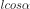

## Introduction

This repo is inspired by the [following Gif](https://twitter.com/jagarikin/status/1393428373368545283):

## Math

The animation is created using these steps:

1. Defining the points for the bottom of the first square, denoted  and  , and its side length  
1. Calculate the top points in the square, denoted   and , using the normal of the line 
1. Calculate , using the angle  and side length 
1. Repeat from step 2, using  and  as base lines, until a minimum side length or maximum recursion depth is reached

 is increased at each frame and loops until the application is shut down:

 

## Requirements

python >= 3.7

## Installation

pip install -r requirements.txt

## Run

python app2.py

## Next steps

1. Run a quick initial recursion with the purpose to split the binary tree into multiple parts (= number of available processes) and send each of these subtrees into the recursion.
1. Store calculations into a pre-allocated array.
1. Drawing the squares is a separate task. This will be made on the main thread when calculations are done.

Since the animation is looped, it can of course be made smoother by pre-calculating positions and rotations of all squares before rendering is started.
