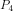
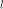
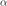
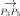
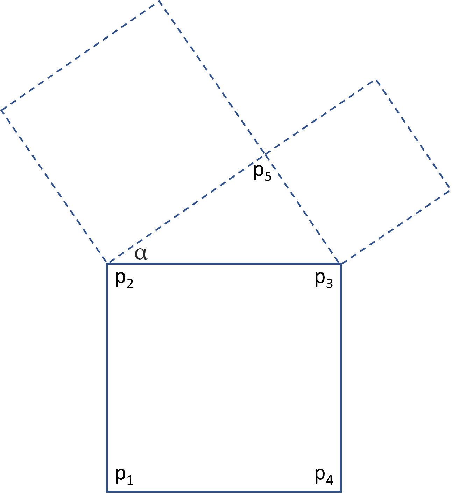
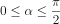

## Introduction

I saw an [animation](https://twitter.com/jagarikin/status/1393428373368545283) and wanted to make something similar. By looking at the animation, it became clear how it works. This algorithm was then implemented using Python3.

## Math

The animation is created by iterating a pretty simple set of rules. We start with defining the points for the bottom of the first square, denoted  and  , and its side length  . We then calculate the top points in the square, denoted   and  , by calculating the normal of the line . To build the child squares, we calculate  using the angle , and then recursively calculate the two child squares using  and  as base lines.

 is increased at each frame and loops until the application is shut down:

 

## Installation

pip install -r requirements.txt

## Run

python app2.py

## Next step

1. Run a quick initial recursion with the purpose to split the binary tree into multiple parts (= number of available processes) and send each of these subtrees into the recursion.
1. Store calculations into a pre-allocated array.
1. Drawing the squares is a separate task. This will be made on the main thread when calculations are done.

Since the animation is looped, it can of course be made smoother by pre-calculating positions and rotations of all squares before rendering is started.

## Learnings

Some Pygame basics from:
http://pygametutorials.wikidot.com/tutorials-basic